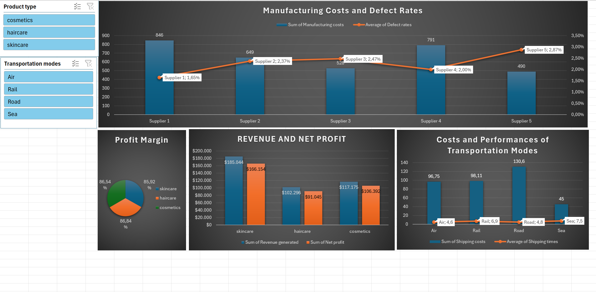

# Supply Chain Performance Dashboard

## Project Overview

This project analyzes supply chain performance using Microsoft Excel.

The objective is to transform raw supply chain data into an interactive dashboard that helps monitor revenue, profitability, supplier performance, and transportation efficiency.

## Dataset

Source: Kaggle Supply Chain Dataset

The dataset contains information about:

- Product types
- Suppliers
- Transportation modes
- Revenue
- Costs
- Manufacturing activities
- Stock levels

## Tools Used

- Microsoft Excel
- Power Query
- Pivot Tables
- Pivot Charts
- Dashboard Design

## Project Workflow

1. Imported raw dataset from Kaggle.
2. Cleaned and transformed data using Power Query.
3. Created calculated metrics such as Net Profit, Inventory Value and Profit Margin.
4. Built Pivot Tables for analysis.
5. Developed an interactive dashboard for reporting and visualization.

## Dashboard Preview

## Key Insights

- Haircare products generate the highest profit margin.
- Air is the most effective transportation mode for its cost
- Supplier 1 & 2 have relatively comparable defect rates, but Supplier 2 has lower cost
- Skincare is the product type that yields the highest revenue

## Skills Demonstrated

- Data Cleaning
- Data Transformation
- Data Visualization
- Dashboard Development
- Business Reporting

